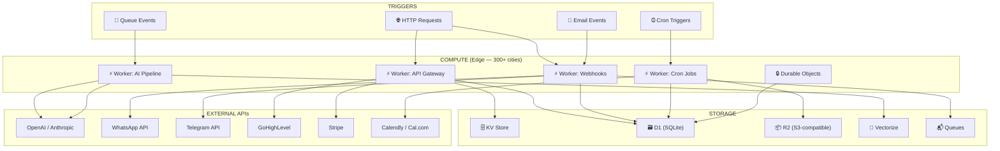
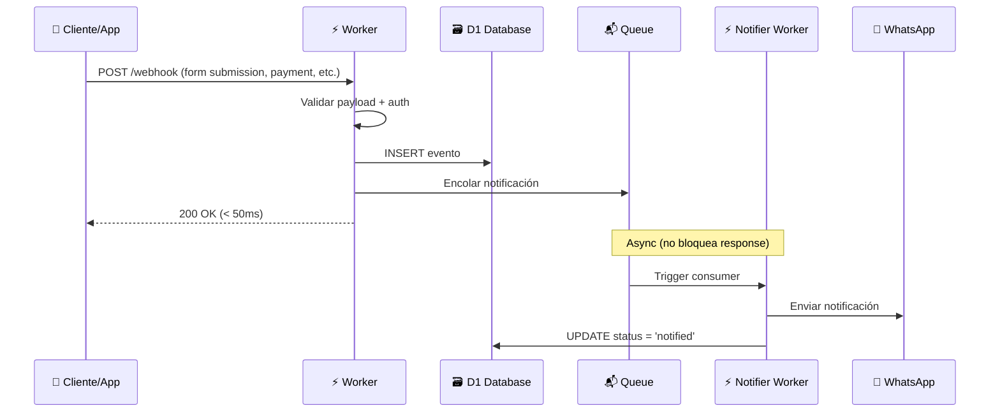
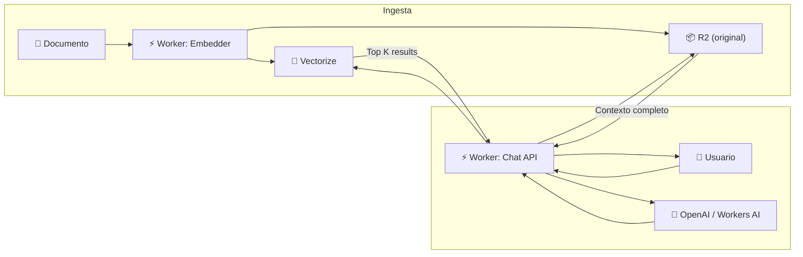
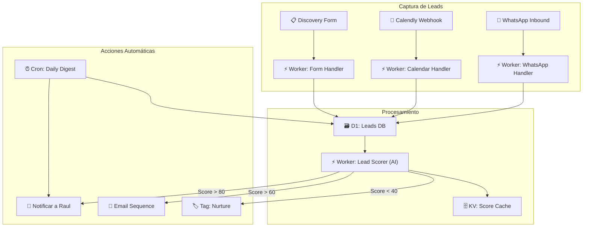
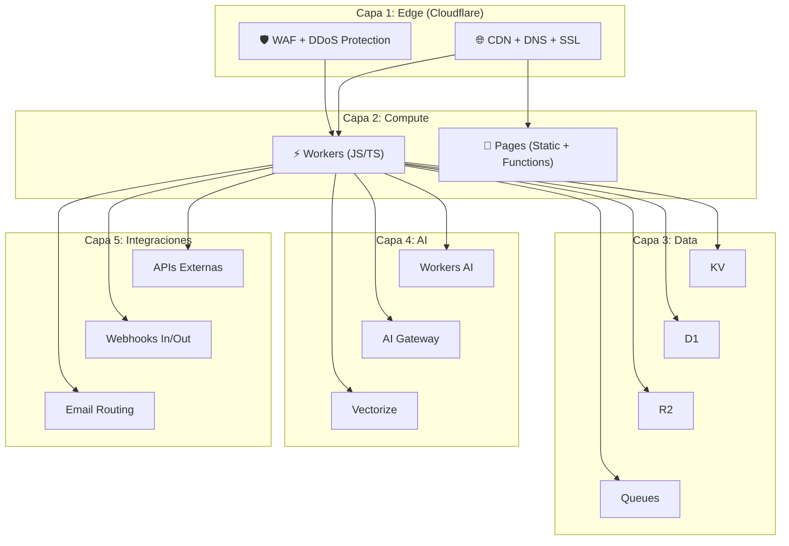

# Cloudflare Workers Platform — Infraestructura Serverless para Consultoría

> Plataforma serverless edge-first para automatizaciones, APIs, webhooks y herramientas de consultoría de IA.

## Por qué Cloudflare Workers

| Ventaja | Detalle |
|---------|---------|
| **Cero servers** | No hay VPS, no hay Docker, no hay mantenimiento. Deploy con `wrangler deploy` |
| **Edge global** | Código corre en 300+ ciudades. Latencia <50ms para cualquier cliente |
| **Free tier generoso** | 100K requests/día gratis. Plan paid $5/mes = 10M requests |
| **Ecosistema completo** | DB, storage, queues, cron, AI — todo integrado sin config externa |
| **JS/TS nativo** | Sin overhead de frameworks. Fetch API estándar |

## Ecosistema Cloudflare — Mapa Completo

### Compute
- **Workers** — Funciones serverless en el edge (JS/TS/WASM). Máx 10ms CPU free, 30s CPU paid
- **Pages Functions** — Workers atados a un sitio estático (ideal para landing + API)
- **Durable Objects** — Estado persistente + WebSockets. Para apps colaborativas, rate limiting, sessions
- **Workflows** — Orquestación de pasos (como Step Functions de AWS pero simple)

### Storage & Data
- **KV** — Key-value global, eventual consistency. Config, feature flags, cache
- **D1** — SQLite serverless. Relacional ligero: usuarios, órdenes, catálogos
- **R2** — Object storage compatible con S3. Sin egress fees (!). Archivos, imágenes, backups
- **Queues** — Message queues para procesamiento async. Emails, notificaciones, batch jobs
- **Vectorize** — Vector DB para embeddings. RAG, búsqueda semántica
- **Hyperdrive** — Proxy/accelerator para Postgres/MySQL existentes

### AI & ML
- **Workers AI** — Modelos de ML corriendo en el edge (LLMs, image gen, embeddings, speech-to-text)
- **AI Gateway** — Proxy para OpenAI/Anthropic/etc con caching, rate limiting, logging

### Triggers
- **HTTP** — Cualquier request a tu worker URL o ruta custom
- **Cron Triggers** — Expresiones cron para tareas periódicas (cada 5min, diario, etc.)
- **Queue consumers** — Se activan cuando llega un mensaje a la queue
- **Email triggers** — Procesar emails entrantes programáticamente
- **Tail Workers** — Observar logs de otros workers en tiempo real

---

## Arquitectura — Diagramas

### 1. Vista General del Ecosistema



### 2. Patrón: Webhook Receiver → Process → Notify



### 3. Patrón: AI Pipeline con RAG



### 4. Patrón: CRM Automático para Consultoría



### 5. Stack Completo — Vista de Capas



---

## Pricing — Lo que Importa

### Free Plan
| Recurso | Límite |
|---------|--------|
| Workers requests | 100,000/día |
| KV reads | 100,000/día |
| KV writes | 1,000/día |
| D1 reads | 5M/día |
| D1 writes | 100K/día |
| D1 storage | 5GB |
| R2 storage | 10GB |
| R2 operations | 1M Class A, 10M Class B / mes |

### Paid Plan ($5/mes)
| Recurso | Incluido | Extra |
|---------|----------|-------|
| Workers requests | 10M/mes | $0.30/M |
| KV reads | 10M/mes | $0.50/M |
| KV writes | 1M/mes | $5.00/M |
| D1 reads | 25B/mes | $0.001/M |
| D1 writes | 50M/mes | $1.00/M |
| D1 storage | 5GB | $0.75/GB |
| R2 storage | 10GB | $0.015/GB |
| Queues | 1M ops/mes | $0.40/M |
| Durable Objects | 1M requests | $0.15/M |

**Key insight:** $5/mes te da una infraestructura que en AWS/GCP costaría $50-200/mes mínimo. Y sin egress fees en R2.

---

## Casos de Uso para Consultoría

### Ya implementados ✅
- **Discovery Form Handler** — Captura leads, guarda en D1, notifica

### Próximos 🔜
1. **Webhook Hub** — Endpoint central para recibir webhooks de GHL, Stripe, Calendly → procesar → notificar
2. **AI Chat API** — RAG sobre documentos de consultoría para clientes
3. **Lead Scoring automático** — Webhook de form → AI scoring → routing automático
4. **Daily Digest Worker** — Cron diario que resume actividad del día
5. **WhatsApp Bot Backend** — Lógica de chatbot para onboarding de clientes
6. **Invoice Generator** — Worker que genera PDFs y los guarda en R2
7. **Client Portal API** — Backend para portal de clientes con auth (D1 + KV sessions)
8. **Analytics Collector** — Pixel de tracking propio, datos en D1, dashboard en Pages

---

## Quick Start — Deploy en 5 Minutos

```bash
# Instalar Wrangler (CLI de Cloudflare)
npm install -g wrangler

# Login
wrangler login

# Crear proyecto
wrangler init mi-worker

# Desarrollo local
wrangler dev

# Deploy
wrangler deploy
```

### Estructura mínima de un Worker
```typescript
export default {
  async fetch(request: Request, env: Env): Promise<Response> {
    const url = new URL(request.url);
    
    if (url.pathname === "/webhook" && request.method === "POST") {
      const data = await request.json();
      // Procesar webhook
      await env.DB.prepare("INSERT INTO events (data) VALUES (?)").bind(JSON.stringify(data)).run();
      return new Response("OK", { status: 200 });
    }
    
    return new Response("Not found", { status: 404 });
  },

  async scheduled(event: ScheduledEvent, env: Env): Promise<void> {
    // Cron trigger
    console.log("Cron ejecutado:", event.cron);
  }
};
```

### wrangler.toml mínimo
```toml
name = "mi-worker"
main = "src/index.ts"
compatibility_date = "2025-01-01"

[[d1_databases]]
binding = "DB"
database_name = "mi-db"
database_id = "xxx"

[triggers]
crons = ["0 9 * * *"]  # Diario a las 9am
```

---

## Workers vs Alternativas

| | CF Workers | AWS Lambda | Vercel Functions | Railway |
|---|---|---|---|---|
| Cold start | ~0ms (edge) | 100-500ms | 50-250ms | 0 (always on) |
| Free tier | 100K req/día | 1M req/mes | 100K req/mes | $5 crédito |
| Pricing | $0.30/M req | ~$0.20/M req | $0.60/M req | Por uso |
| Global edge | ✅ 300+ cities | ❌ Regional | ✅ Edge | ❌ Regional |
| Built-in DB | ✅ D1, KV, R2 | ❌ Separate | ✅ KV, Postgres | ❌ Add-ons |
| Built-in AI | ✅ Workers AI | ✅ Bedrock | ✅ AI SDK | ❌ |
| Max duration | 30s CPU (paid) | 15min | 60s (hobby) | ∞ |
| Language | JS/TS/WASM | Cualquiera | JS/TS | Cualquiera |

---

## Limitaciones Reales

- **No Python nativo** (beta, no maduro). JS/TS es el ciudadano de primera clase
- **30s CPU max** en paid. Para jobs largos necesitas Workflows o server real
- **128MB RAM** por worker. No para ML pesado
- **No file system** — todo es fetch/streams. Sin `fs.readFile()`
- **Eventual consistency en KV** — writes tardan ~60s en propagarse globalmente
- **D1 es SQLite** — no tiene features avanzadas de Postgres (JSON queries limitados, no full-text search nativo)
- **Vendor lock-in parcial** — KV, D1, Durable Objects no son portables

---

## Links de Referencia

- [Workers Docs](https://developers.cloudflare.com/workers/)
- [D1 Docs](https://developers.cloudflare.com/d1/)
- [R2 Docs](https://developers.cloudflare.com/r2/)
- [Workers AI](https://developers.cloudflare.com/workers-ai/)
- [Pricing](https://developers.cloudflare.com/workers/platform/pricing/)
- [Examples](https://developers.cloudflare.com/workers/examples/)
- [Wrangler CLI](https://developers.cloudflare.com/workers/wrangler/)

---

*Creado: 2026-03-08 | Status: Investigación inicial*
